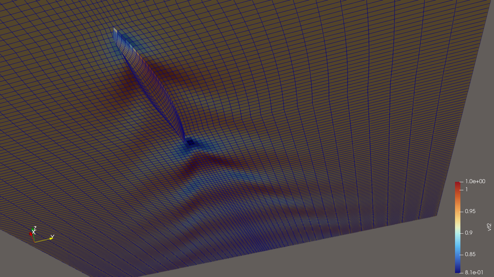

# 3D wave resistance BEM code with linearized free surface condition. 

[Here is the documentation](https://3d-linear-wave-resistance.readthedocs.io/en/latest/)

## tangential velocity 2

Here is a windows 11 workflow:

mingw32-make

./flowsolve.exe fifi.dat outputFileName Fr

where outputFileName a handle that will be used in generating various output files and Fr is the Froude number for the linear steady state wave drag prediciton.
